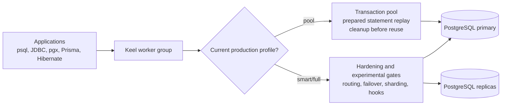
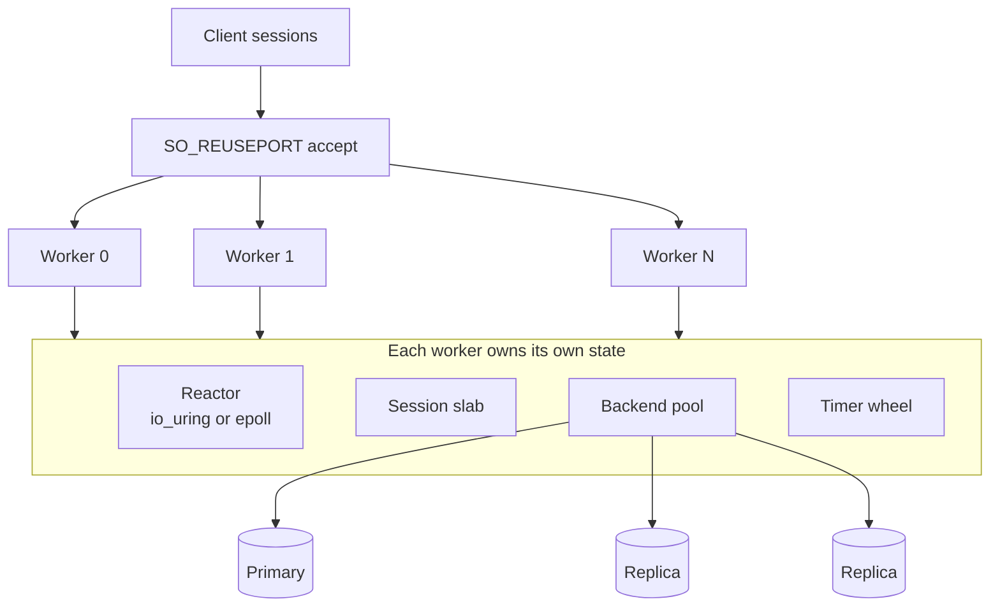

# KEEL

[](https://github.com/virtlabs-io/keel/actions/workflows/ci.yml)
[](https://github.com/virtlabs-io/keel/actions/workflows/hardening.yml)
[](https://codecov.io/gh/virtlabs-io/keel)
[](https://www.gnu.org/licenses/agpl-3.0)

KEEL is a correctness-first PostgreSQL proxy and connection pooler for teams
that need more than a socket fan-out layer, but do not want an opaque database
control plane in front of production traffic.

The current production candidate is intentionally conservative:

```ini
[keel]
experimental_features = false

[worker_group.main]
protocol = postgres
mode = pool
prepared_statement = virtualize
```

That profile focuses on the thing a pooler must get right first: safely sharing
backend database connections across many client sessions, including ORM and
driver workloads that use named prepared statements.

## Why Keel Exists

PostgreSQL already has excellent tools around it. PgBouncer is small and proven.
HAProxy is reliable. Envoy is programmable. Cloud providers ship managed
proxies. So why build another one?

Because modern application traffic has become more stateful than the classic
pooler model assumes. ORMs auto-prepare statements. Drivers pipeline extended
protocol messages. Read replicas introduce read-after-write hazards. Failover
changes which backend is safe. Session state, prepared statements, transaction
state, and route decisions all interact.

Keel started from one idea: a database proxy should know exactly what state it
owns, what state belongs to the backend, and what it must refuse to guess. Its
main innovation is not a single feature. It is the discipline of treating wire
protocol state, pool reuse, routing, and observability as one correctness
problem.

## Where Keel Is Now

Keel is already useful as a PostgreSQL transaction pooler with prepared-statement
virtualization. The broader system is being hardened in stages.

| Maturity | What it means | Keel scope |
|----------|---------------|------------|
| **Production candidate** | Expected to be safe for supported PostgreSQL deployments when configured conservatively and validated against your workload. | PostgreSQL `pool` mode, virtualized named prepared statements, pool cleanup/reuse gates, admin inspection, Prometheus metrics, TLS/mTLS, privilege drop, seccomp baseline. |
| **Hardening** | Implemented and useful, but still accumulating cross-feature and failure-mode coverage. | `smart` routing, sticky-primary read-after-write, SSV/session-state sync, Patroni/native role observation, transaction tracking, MySQL pooling. |
| **Experimental** | Explicit opt-in only. Interfaces or behavior may change while correctness gates close. | Sharding, scatter-merge, multi-shard 2PC, WAL/GTID catch-up probes, cluster compression, web UI, kTLS acceleration, cloud/enterprise auth providers. |
| **Aspirational** | Frameworks or design targets that are not production guarantees. | Result-cache correctness and invalidation guarantees. |
| **Research** | Exploratory ideas that should not be planned into production deployments. | Natural-language query mediation, MCP/agent interfaces, GraphQL-style frontends. |

The source of truth for feature maturity is
[docs/PRODUCTION_READINESS.md](docs/PRODUCTION_READINESS.md). If a feature is
not listed as **Production candidate**, assume it needs deliberate rollout
testing before real traffic.

## The Story in One Diagram



Keel's long-term direction is an elastic database edge: one process that can
pool, route, explain, observe, and eventually coordinate more complex topology
features without making silent correctness tradeoffs. The current release line
does not pretend that every part of that vision is equally mature.

## What Makes Keel Different

- **Prepared statements are first-class state.** Keel virtualizes PostgreSQL
  named `Parse` messages and replays confirmed statements before forwarding
  `Bind`/`Execute` on a new backend. This is designed for real ORM and driver
  behavior, including pipelined extended protocol.
- **Backend reuse is protocol-confirmed.** Dirty connections are cleaned through
  the database protocol and are not returned to idle lists until the backend is
  known to be reusable.
- **The worker hot path is reactor-owned.** Production paths are guarded against
  blocking calls. Backend connect, authentication, send/receive, cleanup, and
  replay are built around non-blocking state machines.
- **Features are tiered, not blurred.** `pool` is the production candidate
  profile. `smart` and `full` unlock more capability, but only after you accept
  their maturity tier and observe their counters.
- **Failure is surfaced instead of hidden.** Ambiguous route, cleanup, replay,
  and failover states are expected to route conservatively, reject, close, or
  expose operator-visible reasons.

## Quick Start

### Install

Use the package guide for DEB, RPM, tarball, and container installs:
[docs/PACKAGE_INSTALL.md](docs/PACKAGE_INSTALL.md).

For local development:

```bash
git clone https://github.com/virtlabs-io/keel.git
cd keel
cmake -S . -B build -DCMAKE_BUILD_TYPE=Release
cmake --build build -j"$(nproc)"
```

### Configure a PostgreSQL Pool

```ini
[keel]
log_level = info
experimental_features = false

[worker_group.main]
protocol = postgres
bind_addr = 0.0.0.0
bind_port = 7432
mode = pool
prepared_statement = virtualize
num_workers = 4
min_pool_size = 10
max_pool_size = 50
server_user = postgres
server_password = postgres
auth_method = scram-sha-256
probe = postgres

[worker_group.main.servers]
primary = host=127.0.0.1 port=5432 dbname=postgres role=RW weight=100
```

Run it:

```bash
./build/src/main/keel -c keel.ini
PGPASSWORD=postgres psql -h 127.0.0.1 -p 7432 -U postgres postgres
```

## Experimental Opt-In Pattern

Experimental features require two signals:

1. Global acknowledgement:

```ini
[keel]
experimental_features = true
```

2. A feature-specific key:

```ini
[worker_group.lab]
mode = smart
scatter_merge = on
wal_lsn_capture = on
```

If a feature needs this pattern, it is not part of the default production
candidate profile. See [docs/COMPATIBILITY.md](docs/COMPATIBILITY.md) for config
key stability and [docs/PRODUCTION_READINESS.md](docs/PRODUCTION_READINESS.md)
for feature maturity.

## Support Boundaries

- **Supported PostgreSQL versions:** see
  [docs/COMPATIBILITY.md#database-backends](docs/COMPATIBILITY.md#database-backends).
  The supported PostgreSQL line is 14 through 17.
- **Known limitations and unsupported features:** see
  [docs/LIMITATIONS.md](docs/LIMITATIONS.md). This includes unsupported protocol
  patterns, sharding limitations, and feature-specific workarounds.
- **Security model:** see [SECURITY.md](SECURITY.md). The short version is:
  Keel is a privileged network proxy at startup, should drop privileges before
  serving traffic, should run with TLS for untrusted networks, and should expose
  admin/metrics ports only to trusted operators.

## Feature Matrix

| Capability | Production candidate | Hardening | Experimental | Aspirational | Research |
|------------|:--------------------:|:---------:|:------------:|:------------:|:--------:|
| PostgreSQL transaction pooling | Yes |  |  |  |  |
| PostgreSQL prepared-statement virtualization | Yes |  |  |  |  |
| TLS/mTLS, privilege drop, seccomp baseline | Yes |  |  |  |  |
| Admin inspection and Prometheus metrics | Yes |  |  |  |  |
| Smart read/write routing |  | Yes |  |  |  |
| Sticky-primary read-after-write |  | Yes |  |  |  |
| Session-state virtualization |  | Yes |  |  |  |
| Patroni/native role observation |  | Yes |  |  |  |
| MySQL pooling |  | Yes |  |  |  |
| Sharding and scatter-merge |  |  | Yes |  |  |
| WAL/GTID replica catch-up probes |  |  | Yes |  |  |
| Multi-proxy cluster compression |  |  | Yes |  |  |
| Cloud and enterprise auth providers |  |  | Yes |  |  |
| Result cache correctness |  |  |  | Yes |  |
| Natural-language or agent-facing query mediation |  |  |  |  | Yes |

## Architecture



Each worker owns its reactor, sessions, backend pool, and timers. There is no
global pool lock in the normal query path.

## Documentation Map

| Need | Start here |
|------|------------|
| Production maturity and gates | [docs/PRODUCTION_READINESS.md](docs/PRODUCTION_READINESS.md) |
| Known limitations | [docs/LIMITATIONS.md](docs/LIMITATIONS.md) |
| Package installation | [docs/PACKAGE_INSTALL.md](docs/PACKAGE_INSTALL.md) |
| Docker | [docs/DOCKER.md](docs/DOCKER.md) |
| Configuration API | [docs/COMPATIBILITY.md](docs/COMPATIBILITY.md) and [docs/CONFIGURATION.md](docs/CONFIGURATION.md) |
| Runtime modes | [docs/RUNTIME_MODES.md](docs/RUNTIME_MODES.md) |
| Prepared statements | [docs/PREPARED_STATEMENTS.md](docs/PREPARED_STATEMENTS.md) |
| Correctness under failure | [docs/CORRECTNESS_UNDER_FAILURE.md](docs/CORRECTNESS_UNDER_FAILURE.md) |
| Operations | [docs/OPERATIONS.md](docs/OPERATIONS.md) |
| Testing | [docs/TESTING.md](docs/TESTING.md) |

## Testing

```bash
cmake --build build -j"$(nproc)"
ctest --test-dir build --output-on-failure
```

Broader suites are documented in [docs/TESTING.md](docs/TESTING.md), including
integration, chaos, sanitizer, and driver torture runs.

## License

Keel is licensed under the GNU Affero General Public License v3.0. See
[LICENSE](LICENSE) for details.
