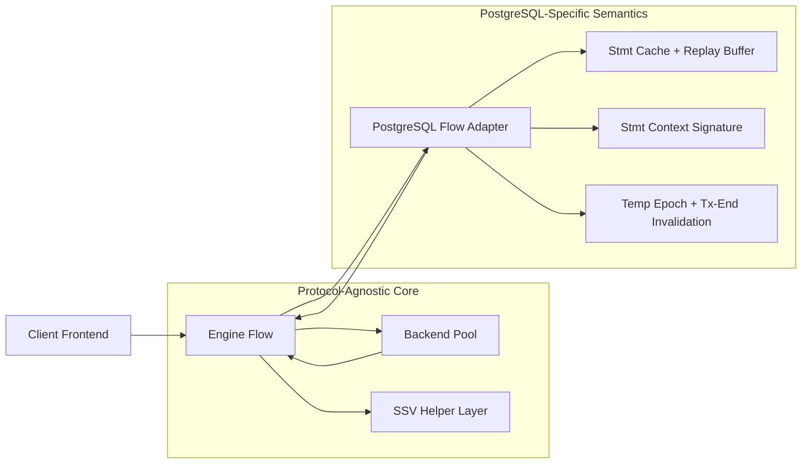
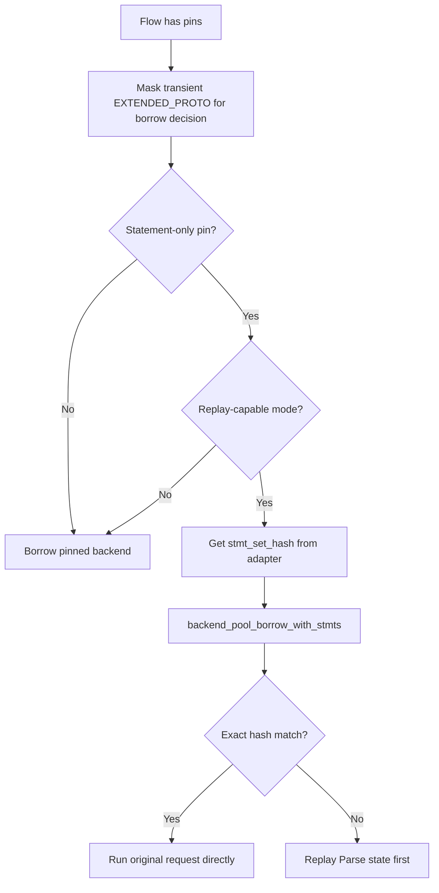
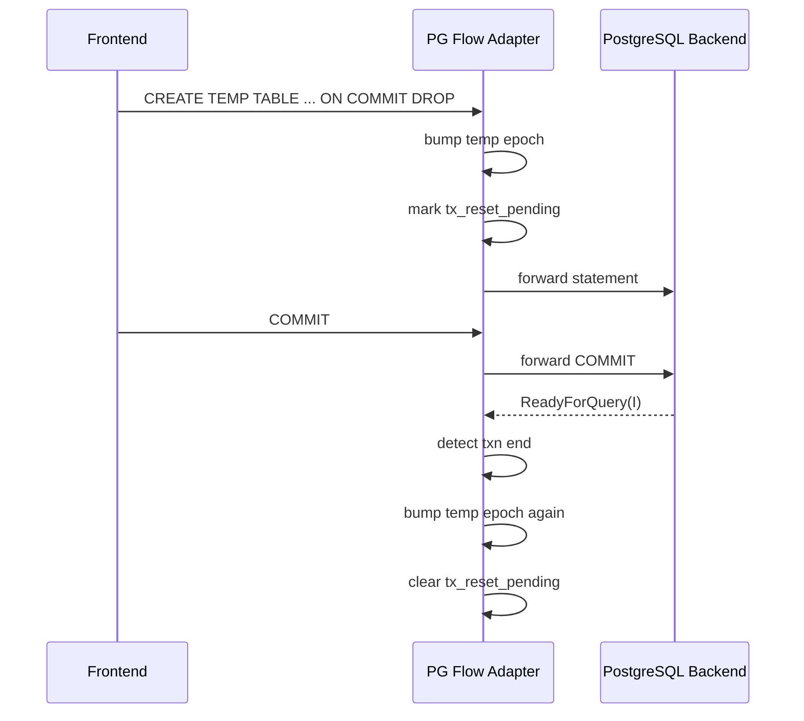
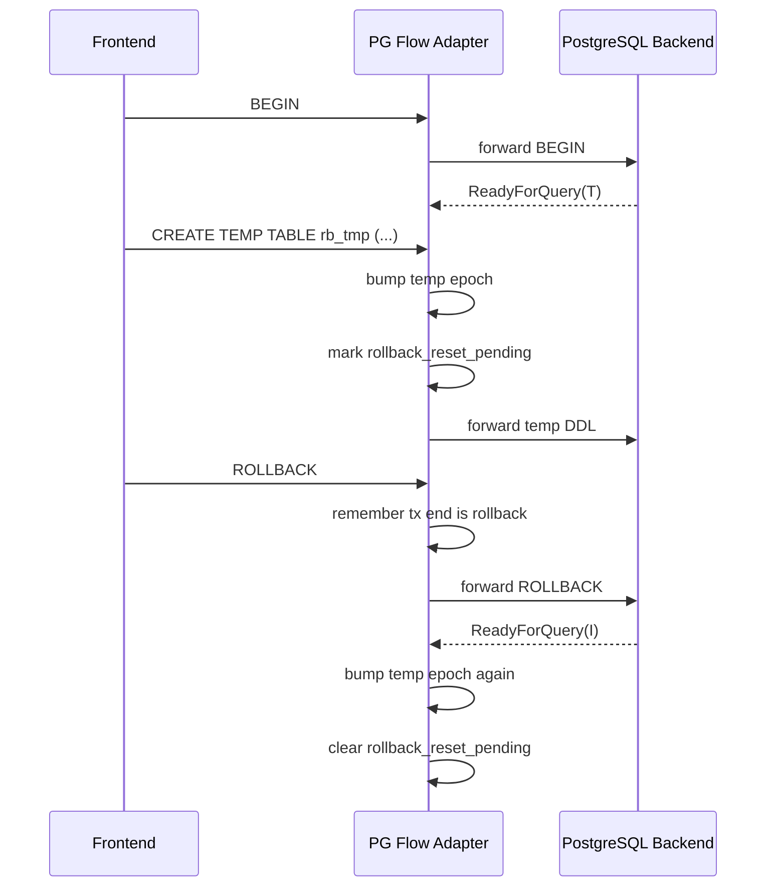
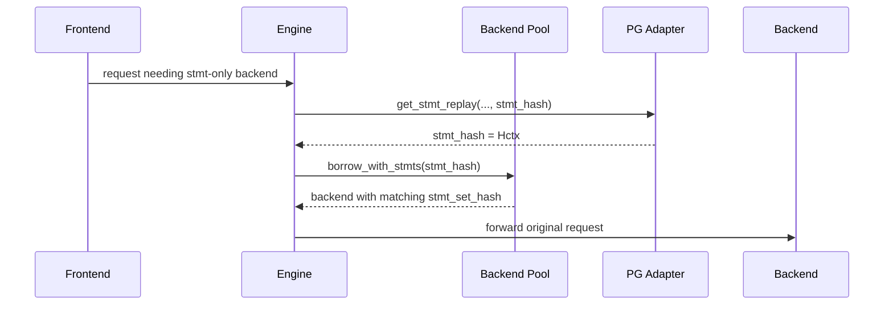
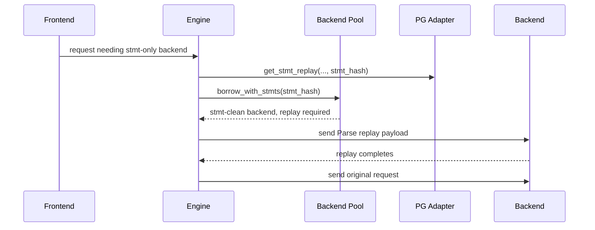

# Semantic State Virtualization for PostgreSQL Prepared Statement Reuse in KEEL

## 1. Executive Summary

This document records the Semantic State Virtualization (SSV) work that was implemented in KEEL for PostgreSQL prepared statement reuse and replay safety.

It is intentionally a statement-centric slice of SSV, not the full end-state of semantic virtualization across every PostgreSQL session feature.

The core requirement that shaped the entire design was strict separation of concerns:

- KEEL core must remain protocol agnostic.
- Protocol-specific semantics must stay inside the PostgreSQL adapter.
- The work must extend KEEL's existing architecture instead of replacing it.

At the core level, KEEL has a small, protocol-agnostic helper layer that centralizes SSV release and pin-policy decisions. All PostgreSQL-specific semantic tracking, hashing, temp-object invalidation, and replay decisions remain inside the PostgreSQL flow implementation.

The implemented end state is:

- prepared statements can remain poolable in replay-capable modes
- backend reuse is allowed when only statement pins remain
- exact statement-set matches fast-path directly to query execution
- mismatches fall back to replay instead of incorrect reuse
- PostgreSQL statement replay hashes account for semantic context, not just SQL text
- temporary object lifecycle changes conservatively invalidate statement context when needed

Validated test status at completion:

- `test_ssv_core`: passing
- `test_pool_correctness`: 114/114 passing
- `test_pg_protocol_flow`: 654/654 passing
- `test_proxy_ssv_e2e`: builds and runs; full execution requires Docker

### Scope boundaries

What is implemented here:

- PostgreSQL prepared statement semantic virtualization for replay-capable reuse
- replay-sensitive statement-context hashing inside the PostgreSQL adapter
- transaction-local overlay handling for replay-sensitive GUCs
- conservative temp-state invalidation for prepared statement correctness
- protocol-agnostic core pin/release helpers used by the engine

What this is not yet:

- a complete virtualization framework for every PostgreSQL session semantic
- a protocol-neutral typed semantic-atom or semantic-plan subsystem
- a unified admissibility model that combines prepared statement semantics with routing and consistency state

### Out of scope for this implementation

The current implementation does not virtualize or rehydrate:

- portals and cursor lifecycle
- `LISTEN` / `UNLISTEN` subscription state
- advisory lock ownership or migration
- `COPY` protocol state
- temp object rehydration
- full object dependency tracking for non-temp DDL
- broader routing and consistency obligations inside the same semantic signature model

## 2. Why This Work Was Needed

KEEL already had most of the architectural building blocks needed for SSV:

- flow pin bits in protocol/engine paths
- state profile hashing and diff-based sync in the session layer
- prepared statement replay support in protocol adapters
- pool borrowing strategies including prepared-statement-aware matching
- runtime modes and prepared statement modes with different semantics

What was missing was a coherent bridge between those systems.

Before this work:

- prepared statement tracking existed, but replay matching was not fully aware of semantic PostgreSQL session context
- engine/session pin export could drift from actual flow pin state
- temp-object lifecycle changes could leave the statement-set hash semantically stale
- borrow and replay logic needed stronger regression coverage for exact-match and mismatch cases

The goal was not to invent a new architecture. The goal was to make KEEL's existing architecture semantically correct for PostgreSQL prepared statement reuse.

## 3. Non-Negotiable Design Constraints

The implementation followed these constraints throughout:

1. Core logic stays protocol agnostic.
2. PostgreSQL semantics stay in the PostgreSQL adapter.
3. Existing KEEL mechanisms are extended, not replaced.
4. Replay-capable modes remain pool-oriented, not session-hard-pinned by default.
5. Safety wins over overly clever inference when semantic ambiguity exists.

That led to a split design:

- generic policy helpers in the session/core layer
- PostgreSQL-local semantic context hashing in the protocol layer

## 4. High-Level Architecture



Core owns policy, orchestration, and pool decisions.

PostgreSQL owns semantic meaning.

That separation is the main architectural decision of this implementation.

## 5. What Changed

### 5.1 Created: protocol-agnostic SSV helper API

New files:

- `include/keel/session/ssv.h`
- `src/session/ssv.c`
- `tests/test_ssv_core.c`

These helpers centralize the generic questions the engine needs to ask:

- how flow pins map to exported session pin reasons
- which pins still block backend release
- whether a pin set is statement-only in the current PS mode

This is intentionally small. It does not understand PostgreSQL semantics.

### 5.2 Adapted: engine flow pin export and release policy

Changed file:

- `src/engine/engine_flow.c`

The engine now uses the new SSV helper layer to:

- synchronize `session->pin_reason` from flow pins whenever pins change
- decide whether a backend may be released in a mode-aware way
- decide whether a pin set is truly statement-only for borrow logic

This removes duplicate policy logic from the engine and makes the release rules explicit.

### 5.3 Extended: PostgreSQL statement context hashing

Changed files:

- `include/keel/protocol/postgres/postgres_flow_internal.h`
- `src/protocol/postgres/postgres_flow.c`

The PostgreSQL adapter now maintains a semantic statement context signature over:

- `search_path`
- `TimeZone`
- `DateStyle`
- `IntervalStyle`
- `standard_conforming_strings`
- `backslash_quote`
- `escape_string_warning`
- `default_tablespace`
- `temp_tablespaces`
- `default_table_access_method`
- `row_security`
- effective role
- session authorization
- temp-object epoch

For the replay-sensitive GUC set, the adapter now distinguishes session-level values from transaction-local overlays created by `SET LOCAL ...` or `set_config(..., true)`.

Prepared statement entries are hashed as:

$$
stmt\_entry\_hash = H(stmt\_name \parallel "|" \parallel stmt\_sql) \oplus stmt\_context\_sig
$$

and the session statement-set hash remains the XOR aggregation of confirmed statement entry hashes:

$$
session\_stmt\_hash = h_1 \oplus h_2 \oplus \dots \oplus h_n
$$

This preserves the existing KEEL shape while making the hash sensitive to semantics that affect statement meaning.

### 5.4 Extended: PostgreSQL temp-context invalidation

The adapter now tracks a conservative temp-object epoch and bumps it when temp-related semantics change.

Covered cases:

- `CREATE TEMP TABLE ...`
- extended-protocol temp DDL through `Parse` + `Execute`
- `ON COMMIT DROP`
- `ON COMMIT DELETE ROWS`
- `DROP TABLE ...` after temp state exists
- `DISCARD TEMP`
- `DISCARD ALL`
- rollback-driven reversion of temp context

The epoch is part of the statement context signature, so any bump forces restamping of all cached statement hashes.

### 5.5 Extended: PostgreSQL semantic GUC tracking

The adapter now hashes additional PostgreSQL semantic dimensions that can make replaying the same prepared SQL text unsafe on a different backend.

Covered dimensions:

- `TimeZone`
- `DateStyle`
- `IntervalStyle`
- `standard_conforming_strings`
- `backslash_quote`
- `escape_string_warning`
- `default_tablespace`
- `temp_tablespaces`
- `default_table_access_method`
- `row_security`

### 5.6 Extended: transaction-local semantic overlays

The adapter now tracks transaction-local stmt-context changes for replay-sensitive GUCs.

Covered forms:

- `SET LOCAL ...`
- `SELECT set_config('...', '...', true)`

These overlays change the effective stmt-context hash immediately, then revert and restamp again when the transaction ends.

### 5.7 Extended: pool/engine replay correctness coverage

Changed files:

- `tests/test_pool_correctness.c`
- `tests/test_pg_protocol_flow.c`

New tests cover:

- exact stmt-hash borrow preference
- mismatch fallback to stmt-clean replay path
- engine fast-path when hashes already match
- engine replay-wait when hashes diverge
- temp-context exact-match vs mismatch behavior
- rollback-temp exact-match vs mismatch behavior

## 6. File Inventory

### New Files

| File | Purpose |
| --- | --- |
| `include/keel/session/ssv.h` | Protocol-agnostic SSV helper API |
| `src/session/ssv.c` | Protocol-agnostic SSV helper implementation |
| `tests/test_ssv_core.c` | Core SSV helper unit tests |
| `tests/keel_ssv_test.ini` | Deterministic single-backend PostgreSQL SSV E2E config |
| `tests/test_proxy_ssv_e2e.c` | Proxy end-to-end SSV validation suite |

### Modified Files

| File | Purpose of Change |
| --- | --- |
| `src/session/CMakeLists.txt` | Add `ssv.c` to the session library build |
| `tests/CMakeLists.txt` | Register `test_ssv_core` |
| `src/engine/engine_flow.c` | Use SSV helpers for pin export and release logic |
| `include/keel/protocol/postgres/postgres_flow_internal.h` | Add PostgreSQL stmt-context fields |
| `src/protocol/postgres/postgres_flow.c` | Add semantic stmt hashing and temp invalidation |
| `tests/test_pg_protocol_flow.c` | Add PostgreSQL semantic tracking regressions |
| `tests/test_pool_correctness.c` | Add pool/engine replay regressions |
| `tests/CMakeLists.txt` | Register dedicated PostgreSQL SSV E2E target and CTest integration |
| `docs/TESTING.md` | Document the SSV E2E suite and CI entrypoint |
| `docker/README.md` | Document Docker-backed SSV validation flow |
| `scripts/hardening-ci.sh` | Add opt-in higher-level CI hook for `test_proxy_ssv_e2e` |

### Other Changed Files Present in the Working Tree

There is also a `.gitignore` update in the working tree that is unrelated to the SSV implementation itself. It is not part of the semantic-state design, but it is part of the current repository change set.

## 7. Core Design Choices

### 7.1 Why the core helper layer is small

The core must not understand PostgreSQL concepts like `search_path`, temp tables, or `DISCARD TEMP` semantics.

So the new core helper layer only answers policy questions that are inherently protocol neutral:

- export flow pins to session-visible reasons
- determine which pins actually block release
- determine whether remaining pin state is statement-only

This keeps the core reusable for other protocols.

### 7.2 Why semantic state was added to statement hashes instead of pool profiles

Prepared statement replay correctness is fundamentally about whether the backend's statement environment is compatible with the frontend session's statement environment.

That compatibility is best represented where prepared statements already live: inside the PostgreSQL flow adapter.

Adding PostgreSQL semantics to the generic state profile mechanism would have violated the architecture boundary and mixed adapter-local meaning into the core.

### 7.3 Why temp tracking uses a conservative epoch instead of full catalog modeling

Exact temp-object modeling would require substantially more PostgreSQL-specific parsing and lifecycle tracking. That would add complexity and still risk missing edge cases.

Instead, this implementation uses a conservative epoch bump strategy:

- if a temp-related action may change statement semantics, bump the epoch
- if transaction end changes temp semantics again, bump the epoch again

This deliberately prefers safe replay over unsafe reuse.

### 7.4 Why replay-capable modes treat stmt-only pins differently from `OFF`

In replay-capable modes, a named prepared statement does not necessarily require hard pinning because KEEL can borrow a compatible backend or replay statements onto a clean backend.

In `KEEL_PS_MODE_OFF`, there is no replay state to rebuild, so `PREPARED_STMT` must remain a hard pin.

That distinction now lives in one place in the SSV helper layer.

### 7.5 Runtime mode and prepared-statement mode applicability

This implementation is primarily governed by PostgreSQL prepared-statement mode, and only secondarily by KEEL's broader runtime tiers.

Prepared-statement mode applicability:

- `tracking`: the strongest and most complete beneficiary of this work because it covers both extended-protocol statements and simple-query `PREPARE ... AS ...`
- `virtualize`: benefits from the same semantic stmt-context hashing for replayed named prepared statements in the extended protocol path
- `pinning`: remains correct through backend affinity rather than semantic replay; the hashing model is not the main enforcement mechanism there
- `anonymous`: uses backend-clean anonymous materialization rather than persistent named backend statement reuse, so this document is not centered on that path
- `OFF`: does not use replay and still treats `PREPARED_STMT` as a blocking hard pin

Runtime tier applicability:

- `proxy`: this SSV slice is effectively dormant because the broader SQL-aware replay path is not the target operating mode there
- `pool`: this implementation is active in the narrow form described here: stmt-hash matching, replay gating, and conservative invalidation
- `smart` and `full`: the same correctness improvements apply, but this patch does not yet add a broader typed semantic admissibility planner or routing/consistency unification specific to those tiers

This matters because the current implementation strengthens one real KEEL path. It does not yet introduce a new standalone runtime-tier framework.

### 7.6 Why worker-locality matters

KEEL is share-nothing on the hot path, and this implementation preserves that.

- stmt cache state is worker-local
- `session_stmt_hash` is computed from worker-local session-side statement state
- backend `stmt_set_hash` is worker-local backend materialization state
- migration moves session-side state, not backend-side prepared statement materialization
- after migration, the target worker re-borrows and rehydrates through the existing replay path as needed

No global live semantic registry was added to the hot path.

## 8. Core SSV Helper Layer

### Responsibilities

The new helper layer provides four small operations:

- `keel_ssv_pin_reason_from_flow_pins(...)`
- `keel_ssv_release_blocking_pins(...)`
- `keel_ssv_allows_backend_release(...)`
- `keel_ssv_is_stmt_only_pin(...)`

### Code Sample

```c
keel_flow_pin_reason_t keel_ssv_release_blocking_pins(
    keel_flow_pin_reason_t pins,
    keel_ps_mode_t ps_mode)
{
    if (ps_mode == KEEL_PS_MODE_OFF)
        return pins;

    return pins & ~(keel_flow_pin_reason_t)KEEL_FPIN_PREPARED_STMT;
}

bool keel_ssv_is_stmt_only_pin(
    keel_flow_pin_reason_t pins,
    keel_ps_mode_t ps_mode)
{
    return ps_mode != KEEL_PS_MODE_OFF && pins == KEEL_FPIN_PREPARED_STMT;
}
```

### Why it matters

Without this, the engine had mode-sensitive pin logic embedded inline. That is harder to reason about and easier to let drift from higher-level session state.

With this helper layer:

- core policy is explicit
- engine decisions are simpler
- tests can validate the policy directly

## 9. Engine Flow Adaptation

The engine integration has two important changes.

### 9.1 Pin export synchronization

Whenever flow pins change, the engine now updates `session->pin_reason` through a small helper:

```c
static inline void sync_session_ssv_state(keel_session_t* session,
                                          keel_session_flow_t* sf)
{
    session->pin_reason = (uint32_t)keel_ssv_pin_reason_from_flow_pins(sf->pins);
}
```

This prevents the session-visible pin reason from drifting away from the actual flow state.

### 9.2 Borrow/release decisions now use the generic helper layer

The engine now delegates two sensitive questions:

- whether a pin set is statement-only
- whether the backend may be released at a transaction boundary

That matters because the distinction between:

- replay-capable PS modes
- pinning mode
- `OFF` mode

is central to correct pooling behavior.

### Borrow Decision Flow



## 10. PostgreSQL Statement Context Model

The PostgreSQL adapter gained the following fields in `pg_flow_ctx_t`:

```c
char     stmt_search_path[256];
char     stmt_timezone[256];
char     stmt_datestyle[256];
char     stmt_intervalstyle[256];
char     stmt_standard_conforming_strings[256];
char     stmt_backslash_quote[256];
char     stmt_escape_string_warning[256];
char     stmt_default_tablespace[256];
char     stmt_temp_tablespaces[256];
char     stmt_default_table_access_method[256];
char     stmt_row_security[256];
char     stmt_role[64];
char     stmt_session_auth[64];
uint64_t stmt_temp_epoch;
bool     stmt_search_path_local_active;
bool     stmt_temp_tx_reset_pending;
bool     stmt_temp_tx_rollback_reset_pending;
bool     stmt_last_tx_end_was_rollback;
uint64_t stmt_context_sig;
```

In the implementation, each replay-sensitive GUC also carries session-level storage, transaction-local storage, and a `*_local_active` flag so the effective stmt context can be reverted on transaction end without leaking PostgreSQL-specific semantics into the core.

Each statement entry now also stores:

```c
uint64_t context_sig;
```

That lets KEEL know not only what SQL a prepared statement contains, but under which semantic environment it was defined.

All of that state remains local to the owning worker and the owning session flow. It is not shared across workers.

### Context Signature Computation

```c
static uint64_t pg_stmt_context_sig(const pg_flow_ctx_t* ctx)
{
    uint64_t hash = keel_hash_fnv1a_64(ctx->stmt_search_path,
                                       strlen(ctx->stmt_search_path));
    hash ^= keel_hash_fnv1a_64("|timezone=", 10);
    hash ^= keel_hash_fnv1a_64(ctx->stmt_timezone, strlen(ctx->stmt_timezone));
    hash ^= keel_hash_fnv1a_64("|datestyle=", 11);
    hash ^= keel_hash_fnv1a_64(ctx->stmt_datestyle, strlen(ctx->stmt_datestyle));
    hash ^= keel_hash_fnv1a_64("|role=", 6);
    hash ^= keel_hash_fnv1a_64(ctx->stmt_role, strlen(ctx->stmt_role));
    hash ^= keel_hash_fnv1a_64("|sauth=", 7);
    hash ^= keel_hash_fnv1a_64(ctx->stmt_session_auth,
                               strlen(ctx->stmt_session_auth));
    hash ^= keel_hash_fnv1a_64("|tepoch=", 8);
    hash ^= keel_hash_fnv1a_64(&ctx->stmt_temp_epoch,
                               sizeof(ctx->stmt_temp_epoch));
    return hash;
}
```

### Restamping Strategy

When one of those dimensions changes, the adapter recomputes the context signature, updates every valid cached statement entry, and recomputes the aggregated session statement hash.

This is the critical bridge between semantic changes and replay safety.

## 11. PostgreSQL Context Dimensions Added

### 11.1 `search_path`

Handled through:

- simple-query parsing for `SET search_path`, `SET SESSION search_path`, `RESET search_path`, `RESET ALL`
- transaction-local overlays via `SET LOCAL search_path ...`
- functional overlays via `set_config('search_path', ..., true)`
- backend `ParameterStatus(search_path)` updates

Why it matters:

- unqualified object resolution depends on `search_path`
- the same SQL text can resolve differently after a path change

### 11.2 Replay-Sensitive PostgreSQL GUCs

Handled through generic adapter-local SQL extraction and stmt-context restamping.

Covered dimensions:

- `TimeZone`
- `DateStyle`
- `IntervalStyle`
- `standard_conforming_strings`
- `backslash_quote`
- `escape_string_warning`
- `default_tablespace`
- `temp_tablespaces`
- `default_table_access_method`
- `row_security`

Why they matter:

- some affect literal parsing and parser behavior
- some affect object placement defaults for prepared DDL
- some affect visibility or policy semantics
- all can make replay onto a different backend semantically unsafe if ignored

### 11.3 Transaction-local semantic overlays

Handled through:

- `SET LOCAL ...`
- `set_config(..., true)`
- transaction-end reversion when `ReadyForQuery(I)` confirms the transaction ended

Why it matters:

- the same session can require one stmt-context hash inside a transaction and another immediately after commit or rollback
- replay safety depends on the effective semantics at the moment a prepared statement is restamped and replayed

### 11.4 `SET ROLE` / `RESET ROLE`

Handled through direct SQL extraction.

Why it matters:

- effective role can affect name resolution, permissions, and behavior visible to prepared statements

### 11.5 `SET SESSION AUTHORIZATION` / `RESET SESSION AUTHORIZATION`

Handled through direct SQL extraction.

Why it matters:

- session authorization changes the statement environment in ways that can invalidate assumptions behind reuse

### 11.6 Temp-object epoch

This is not a direct textual value like `search_path`. It is a conservative semantic version for temp-object state.

Why it matters:

- prepared statement semantics may change when temp objects appear, disappear, or are reset at transaction boundaries

## 12. Temp-Object Invalidation Model

This was the most involved PostgreSQL-specific part of the work.

### 12.1 Immediate temp-context bumps

The adapter bumps `stmt_temp_epoch` when it detects temp-related state changes such as:

- `CREATE TEMP TABLE ...`
- temp DDL through extended protocol
- `DROP TABLE ...` after temp state exists
- `DISCARD TEMP`
- `DISCARD ALL`

### 12.2 Transaction-end second bumps

Some temp changes alter semantics again when the transaction ends.

Examples:

- `ON COMMIT DROP`
- `ON COMMIT DELETE ROWS`

In these cases, the adapter marks `stmt_temp_tx_reset_pending`, then applies another epoch bump when `ReadyForQuery` returns to idle.

### 12.3 Rollback-driven second bumps

If a temp-object change happened in an active transaction, a rollback can revert the effective temp state. The adapter models this with:

- `stmt_temp_tx_rollback_reset_pending`
- `stmt_last_tx_end_was_rollback`

If the transaction ends idle after a rollback, the temp epoch is bumped again.

### Transaction-End Temp Flow



### Rollback Temp Reversion Flow



## 13. The `DISCARD TEMP` Bug and Final Fix

The last implementation bug discovered during validation was that `DISCARD TEMP` was not always causing a temp-context invalidation.

Root cause:

- detection relied too heavily on parsed query classification
- in practice, the adapter needed a direct textual check to treat `DISCARD TEMP` and `DISCARD ALL` as temp-context-changing commands

The final logic in `pg_stmt_is_temp_context_change(...)` now treats these patterns conservatively:

```c
if (pg_sql_contains_word_ci(sql, sql_len, "discard") &&
    (pg_sql_contains_word_ci(sql, sql_len, "temp") ||
     pg_sql_contains_word_ci(sql, sql_len, "all"))) {
    return true;
}
```

That fix closed the final failing test cases.

## 14. Pool Borrow and Replay Semantics

The pool/engine interaction now behaves like this for statement-only sessions in replay-capable modes:

1. Ask the adapter for the current statement-set hash.
2. Borrow a backend with exact statement hash if available.
3. If exact hash exists, run the original request directly.
4. If only stmt-clean backend exists, borrow it and enter statement replay.
5. After replay succeeds, continue with the original request.

### Sequence: Exact-Match Fast Path



### Sequence: Replay Fallback



## 15. Representative Code Snippets

### 15.1 Core release policy

```c
bool keel_ssv_allows_backend_release(
    keel_flow_pin_reason_t pins,
    keel_ps_mode_t ps_mode)
{
    return keel_ssv_release_blocking_pins(pins, ps_mode) == KEEL_FPIN_NONE;
}
```

### 15.2 Statement entry hashing with semantic context

```c
static uint64_t pg_stmt_entry_hash(const pg_stmt_entry_t* entry,
                                   uint64_t context_sig)
{
    uint64_t hash = keel_hash_fnv1a_64(entry->name, strlen(entry->name));
    hash ^= keel_hash_fnv1a_64("|", 1);
    hash ^= keel_hash_fnv1a_64(entry->sql, entry->sql_len);
    hash ^= context_sig;
    return hash;
}
```

### 15.3 Restamping all statements after context change

```c
static void pg_stmt_restamp_context(pg_flow_ctx_t* ctx)
{
    ctx->stmt_context_sig = pg_stmt_context_sig(ctx);
    for (int i = 0; i < PG_STMT_CACHE_SIZE; i++) {
        pg_stmt_entry_t* entry = &ctx->stmt_cache[i];
        if (!entry->valid)
            continue;
        entry->context_sig = ctx->stmt_context_sig;
        entry->hash = pg_stmt_entry_hash(entry, ctx->stmt_context_sig);
    }
    pg_stmt_recompute_session_hash(ctx);
}
```

### 15.4 Temp epoch bump

```c
static void pg_stmt_bump_temp_epoch(pg_flow_ctx_t* ctx)
{
    ctx->stmt_temp_epoch++;
    ctx->metrics_state_changes++;
    pg_stmt_restamp_context(ctx);
}
```

## 16. Tests Added

### 16.1 Core tests

`tests/test_ssv_core.c` validates:

- pin reason export
- release policy across PS modes
- statement-only pin classification

### 16.2 PostgreSQL protocol-flow tests

Added coverage for:

- `search_path` rehash on `SET` and backend `ParameterStatus`
- `SET LOCAL search_path` rehash plus transaction-end reversion
- `set_config('search_path', ..., true)` rehash plus rollback reversion
- `TimeZone`
- `DateStyle`
- `IntervalStyle`
- `standard_conforming_strings`
- `backslash_quote`
- `escape_string_warning`
- `default_tablespace`
- `temp_tablespaces`
- `default_table_access_method`
- `row_security`
- `RESET ALL` across tracked semantic GUCs
- `SET ROLE` and `RESET ROLE`
- `SET SESSION AUTHORIZATION` and reset
- temp create via simple and extended protocol
- `ON COMMIT DROP`
- `ON COMMIT DELETE ROWS`
- `DROP TABLE`
- `DISCARD TEMP`
- rollback-driven temp reversion

### 16.3 Pool and engine correctness tests

Added coverage for:

- exact stmt hash borrow preferred over stmt-clean backend
- mismatch fallback to replay
- exact temp-context hash skips replay
- temp-context mismatch enters replay
- rollback-restamped temp-context exact match skips replay
- rollback-restamped temp-context mismatch replays

### 16.4 Proxy end-to-end tests

Added a dedicated deterministic proxy SSV suite with a single worker and a single backend slot.

Covered end-to-end cases:

- `search_path` change with prepared statement replay
- `SET LOCAL search_path` commit-time reversion
- `set_config('search_path', ..., true)` rollback-time reversion
- `DateStyle`-driven ambiguous date literal replay
- `TimeZone`-driven `timestamptz` literal replay
- temp rollback reversion
- `DISCARD TEMP` reversion

## 17. Validation Summary

Validated during implementation with focused rebuilds and test runs.

Final observed status:

- `test_pool_correctness`: 114/114 passed
- `test_pg_protocol_flow`: 686/686 passed
- `test_proxy_ssv_e2e`: 289/289 passed (16 tests; requires Docker)

Bug found and fixed during edge-case stress testing:

- **XOR hash cancellation**: with an even number of prepared statements, the context signature (GUC state) cancelled out of the session hash due to XOR self-inverse, making GUC changes invisible to the replay engine. Fixed by moving context_sig out of per-entry hashes and folding it once in `pg_stmt_recompute_session_hash()`.

The most important functional validation points were:

- semantic changes now change the statement-set hash
- exact semantic matches no longer replay unnecessarily
- semantic mismatches do replay
- transaction-local semantic overlays now rehash on entry and revert on tx end
- temp lifecycle edges no longer silently reuse stale statement context

## 18. What Was Adapted Instead of Rewritten

This implementation explicitly extended existing KEEL mechanisms rather than replacing them.

### Existing mechanism reused: flow pins

Adaptation:

- introduced a small core helper layer instead of inventing a new state model

### Existing mechanism reused: statement replay

Adaptation:

- strengthened replay correctness by improving how the adapter computes statement-set hashes

### Existing mechanism reused: backend pool stmt matching

Adaptation:

- added tests and correct hash semantics instead of changing the borrowing model

### Existing mechanism reused: transaction boundary handling

Adaptation:

- hooked temp-context second-stage invalidation into `ReadyForQuery` transitions

### Existing mechanism reused: state profile and session state architecture

Adaptation:

- kept them intact; PostgreSQL semantic stmt context remained adapter-local

## 19. Tradeoffs and Known Limitations

This implementation is deliberately conservative.

Known tradeoffs:

- temp invalidation is epoch-based, not exact object-level dependency tracking
- SQL extraction for role and search-path changes is intentionally practical, not a full SQL parser
- `DROP TABLE` invalidation is conservative once temp state exists
- the work focuses on PostgreSQL prepared statement correctness, not full session-semantic virtualization
- broader session semantics such as `LISTEN`, advisory locks, portals, cursors, and `COPY` remain outside this virtualization slice
- routing and consistency obligations are now partially integrated through the SSV consistency atom layer (see §22), but the full protocol-neutral admissibility model remains future work

These are acceptable tradeoffs for the current scope because they preserve safety while keeping complexity bounded.

## 20. Gap Analysis and Phase 2 Roadmap

The next step is not to replace this design. The next step is to extend it selectively where KEEL currently relies on conservative pinning or separate correctness mechanisms.

### 20.1 Session semantics still pinned or modeled elsewhere

These areas are not yet virtualized in the same way as prepared statement semantic reuse:

- broader session GUC continuity beyond the replay-sensitive allowlist in this document
- `LISTEN` / `UNLISTEN` subscription state
- advisory lock ownership
- portal and cursor lifecycle
- `COPY` state

**Now addressed (see §22):** routing and consistency obligations such as read-after-write and sticky-primary admissibility are now modeled through SSV consistency atoms (`KEEL_SSV_DOMAIN_CONSISTENCY`), which carry WAL LSN tokens and unknown-state flags in the session flow state.

### 20.2 Areas likely to stay pinned for the near term

Some semantics are poor candidates for near-term virtualization because they are deeply backend-resident or stream-coupled:

- active `COPY` flows
- open portals and cursors with backend-resident execution state
- asynchronous `LISTEN` subscriptions unless KEEL gains an explicit adapter-level notification ownership model
- advisory locks unless ownership transfer and legality can be modeled explicitly

The safe current behavior for these areas is conservative pinning.

### 20.3 Best candidates for Phase 2 virtualization

The highest-value next adapter-level semantic extensions are:

1. Broader PostgreSQL session GUC continuity policy for values that can change statement meaning or replay safety.
2. More functional or procedural mutation coverage beyond `set_config(..., true)`.
3. Explicit classification of semantics that should remain permanently pinned versus semantics that can be rehydrated.
4. Broader E2E regressions around ugly transaction-end sequences that mix temp state, overlays, prepare, and replay.

### 20.4 Generic SSV framework work that still remains

The first concrete slice of a protocol-neutral typed semantic-domain model is now implemented as the **SSV atom type system** (see §22).  The `KEEL_SSV_DOMAIN_CONSISTENCY` domain provides:

- a small typed semantic-domain model (`keel_ssv_domain_t`, `keel_ssv_virt_class_t`, `keel_ssv_cost_class_t`)
- explicit integration of routing and consistency state into admissibility via `keel_ssv_requires_primary()` and `keel_ssv_needs_discard()`
- zero-allocation/zero-lock inline helpers that meet the hot-path isolation constraint

What still remains for a fully generalized SSV framework:

- extending the atom model to cover CONFIG, EXEC_OBJECT, TXN, NAMESPACE, and SECURITY domains (currently defined as enum values but not populated)
- a protocol-neutral sync or cleanup planning interface layered on top of existing `state_profile_t`, cleanup, and replay hooks
- a scoring or cost-based borrow algorithm that considers atom-level compatibility across all domains, not just hash equality

### 20.5 Phase 2 validation priorities

The most valuable next stress areas are:

1. Functional GUC mutation beyond the currently covered parsing forms.
2. Non-temp DDL that can change prepared statement meaning after reuse.
3. Edge protocol sequences mixing role or session-authorization changes with extended-protocol execution.
4. Transaction-end replay ordering for sequences such as `BEGIN`, `SET LOCAL`, `PREPARE`, temp DDL, `ROLLBACK`, then replay on a different backend.

Phase 2 edge-case stress tests now implemented (7 new tests in `test_proxy_ssv_e2e`):

| Test | Coverage |
|------|----------|
| `ugly_begin_setlocal_prepare_tempdll_rollback` | Priority 4: full ugly-sequence endurance |
| `multi_guc_change_replays_correctly` | Priority 1: simultaneous DateStyle+TimeZone replay |
| `prepare_under_local_overlay_then_commit` | SET LOCAL overlay revert after COMMIT |
| `non_temp_ddl_between_prepare_execute` | Priority 2: ALTER TABLE with active prepared stmts |
| `interleaved_prepare_deallocate_guc_changes` | DEALLOCATE+GUC interleaving with 2 stmts |
| `set_local_in_failed_tx_rollback` | Failed-transaction overlay revert |
| `rapid_guc_toggle` | Rapid SET/RESET cycles |

Known Phase 2 gap documented:

- **Parse-time GUC + SET LOCAL re-preparation**: when a prepared statement is created under a SET LOCAL overlay (e.g., DateStyle), the backend's plan retains the local semantics after COMMIT reverts the overlay. The backend is stamped with the post-revert hash, preventing re-preparation. This affects parse-time GUCs (DateStyle, TimeZone) but not execute-time GUCs (search_path).

## 21. Implementation Outcome

The work is complete for the currently scoped PostgreSQL prepared-statement SSV slice.

The final architecture is consistent with KEEL's existing design:

- core policy is generic
- PostgreSQL meaning is local to the PostgreSQL adapter
- backend reuse remains efficient for exact matches
- replay is triggered when semantic divergence exists
- temp lifecycle edges are modeled conservatively and validated by regression tests
- the implementation is a high-value first slice of SSV, not the complete end-state across all PostgreSQL session semantics

## 22. SSV Consistency Atom Layer

### 22.1 Overview

The SSV consistency atom layer extends the protocol-agnostic SSV helpers with a formal typed atom model.  It provides the foundation for carrying WAL LSN requirements, unknown-state flags, and future semantic dimensions directly in the session flow state — without mutexes, heap allocation, or protocol-specific logic in the core.

This addresses the gap identified in §20.4: routing and consistency obligations are now modeled through SSV atoms rather than ad-hoc timestamp checks.

### 22.2 Type System

**File:** `include/keel/session/ssv_atom.h`

The atom type system defines three orthogonal classification axes:

| Axis | Enum | Values |
|------|------|--------|
| Semantic domain | `keel_ssv_domain_t` | CONFIG, EXEC_OBJECT, TXN, NAMESPACE, SECURITY, **CONSISTENCY**, OPAQUE |
| Virtualization class | `keel_ssv_virt_class_t` | FULL (can always virtualize), CONDITIONAL (needs runtime check), NONE (not virtualizable), OPAQUE (unknown) |
| Cost class | `keel_ssv_cost_class_t` | CHEAP (< 100 cycles), MODERATE (< 1000 cycles), EXPENSIVE (network I/O), PROHIBITIVE (must avoid) |

Each atom carries:

```c
typedef struct keel_ssv_atom {
    keel_ssv_domain_t      domain;
    keel_ssv_virt_class_t  virt_class;
    keel_ssv_cost_class_t  cost_class;
    uint16_t               key;
    keel_ssv_value_t       value;   /* union: u64, i64, flag, f64, str[128] */
} keel_ssv_atom_t;
```

### 22.3 Consistency Domain

The CONSISTENCY domain uses a fixed 3-element atom array per session:

| Index | Key | Virt Class | Cost Class | Value Type | Purpose |
|-------|-----|------------|------------|------------|---------|
| 0 | `WRITE_LSN` | CONDITIONAL | EXPENSIVE | `str[128]` | WAL LSN string (e.g., `"0/16B3740"`) |
| 1 | `WRITE_LSN_TS` | FULL | CHEAP | `u64` | Monotonic timestamp of capture (nanoseconds) |
| 2 | `UNKNOWN_STATE` | NONE | CHEAP | `flag` | Session executed unmodellable command |

**Storage:** `keel_session_flow_t.consistency_atoms[3]` — stack-allocated in the session flow struct.  Zero heap allocation, zero locks.

**Initialization:** `keel_ssv_consistency_init()` is called from `keel_session_flow_init()`.

### 22.4 Operational Invariants

Three invariants govern the consistency atom layer:

1. **Hot-Path Isolation:** No `pthread_mutex_t` in the SSV atom path.  All helpers are `static inline` operating on per-session data.  The atoms are owned by the session and never shared across workers.

2. **Cost Gating:** The WRITE_LSN atom is classified as `KEEL_SSV_COST_EXPENSIVE` (network I/O required to capture).  The capture is deferred to the backend-complete path and performed only when `capture_lsn_pending` is set — never speculatively.

3. **Unknown State Rule:** When the protocol adapter detects an unmodellable command, it sets `keel_ssv_consistency_set_unknown(atoms)`.  On pool return, the engine checks `keel_ssv_consistency_has_unknown()` and forces the backend's `current_state_hash` to the DISCARD ALL sentinel (`0xFFFFFFFFFFFFFFFFULL`), ensuring the next borrower gets a clean backend.

### 22.5 Engine Integration Points

**LSN Capture** (`engine_flow.c` — backend-complete path):

After `ReadyForQuery` confirms a write/DDL, the engine:
1. Checks `sf->capture_lsn_pending && session->backend_conn && flow->capture_consistency_token`
2. Temporarily switches the backend fd to blocking mode (`fcntl`)
3. Calls `flow->capture_consistency_token()` to execute `SELECT pg_current_wal_lsn()` and drain the response
4. Restores non-blocking mode
5. Stores the token in both `sf->last_write_token` (legacy) and `sf->consistency_atoms` (atom layer) via `keel_ssv_consistency_set_token()`

**Sticky-Primary Routing** (`engine_flow.c` — FE query path):

The time-based sticky-primary check now uses the consistency atom TTL:

```c
if (!keel_ssv_consistency_ttl_ok(sf->consistency_atoms, now, ttl_ms)) {
    route = KEEL_FROUTE_PRIMARY;   // TTL active → force primary
} else {
    sf->last_write_ns = 0;         // TTL expired → clear
    keel_ssv_consistency_clear(sf->consistency_atoms);
}
```

`keel_ssv_consistency_ttl_ok()` checks whether `(now_ns - captured_at_ns) >= ttl_ms * 1e6`.  Returns `true` when the TTL has expired (replica is safe), `false` when the write is still recent (primary required).

**Unknown-State DISCARD ALL** (`engine_flow.c` — pool return path):

Before the prepared-statement hash reconciliation, the engine checks:

```c
if (keel_ssv_consistency_has_unknown(sf->consistency_atoms)) {
    be->current_state_hash = 0xFFFFFFFFFFFFFFFFULL;  // sentinel → DISCARD ALL
    be->stmt_set_hash      = 0;
}
```

This ensures any backend that executed an unmodellable command is cleaned before reuse.

### 22.6 SSV Helper API Additions

**File:** `include/keel/session/ssv.h`, `src/session/ssv.c`

Two new helpers centralize consistency-aware decisions for callers outside `engine_flow.c`:

| Function | Signature | Purpose |
|----------|-----------|---------|
| `keel_ssv_requires_primary()` | `(const atoms[3], now_ns, ttl_ms) → bool` | Returns `true` if the session has a recent write LSN whose TTL hasn't expired — primary routing required |
| `keel_ssv_needs_discard()` | `(const atoms[3]) → bool` | Returns `true` if the session has unknown/unmodellable state — DISCARD ALL required on pool return |

### 22.7 Test Coverage

**File:** `tests/test_ssv_atom.c` — 10 test functions, 37 assertions:

| Test | What It Validates |
|------|-------------------|
| `test_atom_init` | Init zeroes values, assigns correct domain/virt_class/cost_class per atom |
| `test_atom_clear` | Clear resets values but preserves structural fields |
| `test_set_get_token` | LSN string and timestamp storage/retrieval round-trip |
| `test_no_token` | Empty state correctly reports no write LSN |
| `test_unknown_state` | Set/has/clear lifecycle for the unknown-state flag |
| `test_ttl_within` | TTL still active → `ttl_ok` returns false (primary required) |
| `test_ttl_expired` | TTL expired → `ttl_ok` returns true (replica safe) |
| `test_ttl_no_token` | No token → `ttl_ok` returns true (no write to protect) |
| `test_ssv_requires_primary` | End-to-end `keel_ssv_requires_primary()` with recent and expired writes |
| `test_ssv_needs_discard` | `keel_ssv_needs_discard()` reflects unknown-state flag |

### 22.8 Design Decision: Why Not Merkle Trees?

The SSV atom layer uses flat arrays with O(1) hash comparison for borrow matching and O(n) two-pointer merge for state diff generation.  Merkle trees were evaluated and rejected because:

- **Dataset is trivially small:** ≤ 64 SET variables, ≤ 16 prepared statements, 3 consistency atoms.  The fast path is already a single `uint64_t` comparison per candidate backend.
- **No partial-sync benefit:** KEEL's `generate_sync_sql()` already produces minimal SET/RESET commands via sorted two-pointer merge in O(n) for n ≤ 64.
- **Tree maintenance overhead:** Every SET/RESET would require O(log n) hash recomputations plus per-backend tree shadow maintenance — for zero borrow-path improvement.
- **Memory cost:** A 64-leaf Merkle tree would add ≥ 640 bytes per `backend_conn_t` with no measurable benefit at current pool sizes.

The higher-value optimization for large pools (200+ connections) is a hash-bucket index on `current_state_hash` to eliminate the O(n) idle-list scan — not a tree-based state representation.

That is the intended extension of KEEL, not a rewrite of it.